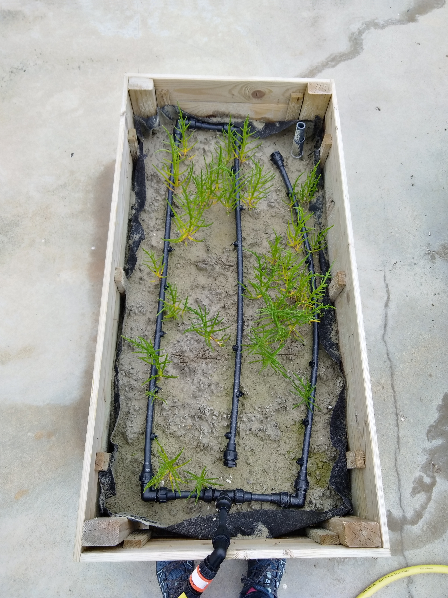

```{r setup, include=FALSE}
knitr::opts_chunk$set(echo = FALSE)
require(tidyverse)
require(plotly)
require(lubridate)
```

### 13/03/2020


<div class="w3-content w3-display-container">

<div class="w3-display-container mySlides0">
  
  <div class="w3-display-bottomleft w3-large w3-container w3-padding-16 w3-black">
    BAC n°1
  </div>
</div>

<div class="w3-display-container mySlides0">
  
  <div class="w3-display-bottomleft w3-large w3-container w3-padding-16 w3-black">
    BAC n°2
  </div>
</div>

<div class="w3-display-container mySlides0">
  
  <div class="w3-display-bottomleft w3-large w3-container w3-padding-16 w3-black">
    BAC n°3
  </div>
</div>

<div class="w3-display-container mySlides0">
  
  <div class="w3-display-bottomleft w3-large w3-container w3-padding-16 w3-black">
    BAC n°4
  </div>
</div>

<div class="w3-display-container mySlides0">
  
  <div class="w3-display-bottomleft w3-large w3-container w3-padding-16 w3-black">
    BAC n°5
  </div>
</div>

<div class="w3-display-container mySlides0">
  
  <div class="w3-display-bottomleft w3-large w3-container w3-padding-16 w3-black">
    BAC n°6
  </div>
</div>

<div class="w3-display-container mySlides0">
  
  <div class="w3-display-bottomleft w3-large w3-container w3-padding-16 w3-black">
    BAC n°7
  </div>
</div>

<div class="w3-display-container mySlides0">
  
  <div class="w3-display-bottomleft w3-large w3-container w3-padding-16 w3-black">
    BAC n°8
  </div>
</div>

<div class="w3-display-container mySlides0">
  
  <div class="w3-display-bottomleft w3-large w3-container w3-padding-16 w3-black">
    BAC n°9
  </div>
</div>

  <button class="w3-button w3-black w3-display-left" onclick="plusDivs0(-1)">&#10094;</button>
  <button class="w3-button w3-black w3-display-right" onclick="plusDivs0(1)">&#10095;</button>
</div>


<script>
var slideIndex = 1;
showDivs0(slideIndex);

function plusDivs0(n) {
  showDivs0(slideIndex += n);
}

function showDivs0(n) {
  var i;
  var x = document.getElementsByClassName("mySlides0");
  if (n > x.length) {slideIndex = 1}
  if (n < 1) {slideIndex = x.length}
  for (i = 0; i < x.length; i++) {
    x[i].style.display = "none";  
  }
  x[slideIndex-1].style.display = "block";  
}
</script>


### 27/05/2020

<div class="w3-content w3-display-container">

<div class="w3-display-container mySlides">
  
  <div class="w3-display-bottomleft w3-large w3-container w3-padding-16 w3-black">
    BAC n°1
  </div>
</div>

<div class="w3-display-container mySlides">
  
  <div class="w3-display-bottomleft w3-large w3-container w3-padding-16 w3-black">
    BAC n°2
  </div>
</div>

<div class="w3-display-container mySlides">
  
  <div class="w3-display-bottomleft w3-large w3-container w3-padding-16 w3-black">
    BAC n°3
  </div>
</div>

<div class="w3-display-container mySlides">
  
  <div class="w3-display-bottomleft w3-large w3-container w3-padding-16 w3-black">
    BAC n°4
  </div>
</div>

<div class="w3-display-container mySlides">
  
  <div class="w3-display-bottomleft w3-large w3-container w3-padding-16 w3-black">
    BAC n°5
  </div>
</div>

<div class="w3-display-container mySlides">
  
  <div class="w3-display-bottomleft w3-large w3-container w3-padding-16 w3-black">
    BAC n°6
  </div>
</div>

<div class="w3-display-container mySlides">
  
  <div class="w3-display-bottomleft w3-large w3-container w3-padding-16 w3-black">
    BAC n°7
  </div>
</div>

<div class="w3-display-container mySlides">
  
  <div class="w3-display-bottomleft w3-large w3-container w3-padding-16 w3-black">
    BAC n°8
  </div>
</div>

<div class="w3-display-container mySlides">
  
  <div class="w3-display-bottomleft w3-large w3-container w3-padding-16 w3-black">
    BAC n°9
  </div>
</div>

  <button class="w3-button w3-black w3-display-left" onclick="plusDivs(-1)">&#10094;</button>
  <button class="w3-button w3-black w3-display-right" onclick="plusDivs(1)">&#10095;</button>
</div>


<script>
var slideIndex = 1;
showDivs(slideIndex);

function plusDivs(n) {
  showDivs(slideIndex += n);
}

function showDivs(n) {
  var i;
  var x = document.getElementsByClassName("mySlides");
  if (n > x.length) {slideIndex = 1}
  if (n < 1) {slideIndex = x.length}
  for (i = 0; i < x.length; i++) {
    x[i].style.display = "none";  
  }
  x[slideIndex-1].style.display = "block";  
}
</script>

### 10/06/2020

<div class="w3-content w3-display-container">

<div class="w3-display-container mySlides2">
  
  <div class="w3-display-bottomleft w3-large w3-container w3-padding-16 w3-black">
    BAC n°1
  </div>
</div>

<div class="w3-display-container mySlides2">
  
  <div class="w3-display-bottomleft w3-large w3-container w3-padding-16 w3-black">
    BAC n°2
  </div>
</div>

<div class="w3-display-container mySlides2">
  
  <div class="w3-display-bottomleft w3-large w3-container w3-padding-16 w3-black">
    BAC n°3
  </div>
</div>

<div class="w3-display-container mySlides2">
  
  <div class="w3-display-bottomleft w3-large w3-container w3-padding-16 w3-black">
    BAC n°4
  </div>
</div>

<div class="w3-display-container mySlides2">
  
  <div class="w3-display-bottomleft w3-large w3-container w3-padding-16 w3-black">
    BAC n°5
  </div>
</div>

<div class="w3-display-container mySlides2">
  
  <div class="w3-display-bottomleft w3-large w3-container w3-padding-16 w3-black">
    BAC n°6
  </div>
</div>

<div class="w3-display-container mySlides2">
  
  <div class="w3-display-bottomleft w3-large w3-container w3-padding-16 w3-black">
    BAC n°7
  </div>
</div>

<div class="w3-display-container mySlides2">
  
  <div class="w3-display-bottomleft w3-large w3-container w3-padding-16 w3-black">
    BAC n°8
  </div>
</div>

<div class="w3-display-container mySlides2">
  
  <div class="w3-display-bottomleft w3-large w3-container w3-padding-16 w3-black">
    BAC n°9
  </div>
</div>

  <button class="w3-button w3-black w3-display-left" onclick="plusDivs2(-1)">&#10094;</button>
  <button class="w3-button w3-black w3-display-right" onclick="plusDivs2(1)">&#10095;</button>
</div>


<script>
var slideIndex = 1;
showDivs2(slideIndex);

function plusDivs2(n) {
  showDivs2(slideIndex += n);
}

function showDivs2(n) {
  var i;
  var x = document.getElementsByClassName("mySlides2");
  if (n > x.length) {slideIndex = 1}
  if (n < 1) {slideIndex = x.length}
  for (i = 0; i < x.length; i++) {
    x[i].style.display = "none";  
  }
  x[slideIndex-1].style.display = "block";  
}
</script>


### 24/07/2020

<div class="w3-content w3-display-container">

<div class="w3-display-container mySlides3">
  
  <div class="w3-display-bottomleft w3-large w3-container w3-padding-16 w3-black">
    BAC n°1
  </div>
</div>

<div class="w3-display-container mySlides3">
  
  <div class="w3-display-bottomleft w3-large w3-container w3-padding-16 w3-black">
    BAC n°2
  </div>
</div>

<div class="w3-display-container mySlides3">
  
  <div class="w3-display-bottomleft w3-large w3-container w3-padding-16 w3-black">
    BAC n°3
  </div>
</div>

<div class="w3-display-container mySlides3">
  
  <div class="w3-display-bottomleft w3-large w3-container w3-padding-16 w3-black">
    BAC n°4
  </div>
</div>

<div class="w3-display-container mySlides3">
  
  <div class="w3-display-bottomleft w3-large w3-container w3-padding-16 w3-black">
    BAC n°5
  </div>
</div>

<div class="w3-display-container mySlides3">
  
  <div class="w3-display-bottomleft w3-large w3-container w3-padding-16 w3-black">
    BAC n°6
  </div>
</div>

<div class="w3-display-container mySlides3">
  
  <div class="w3-display-bottomleft w3-large w3-container w3-padding-16 w3-black">
    BAC n°7
  </div>
</div>

<div class="w3-display-container mySlides3">
  
  <div class="w3-display-bottomleft w3-large w3-container w3-padding-16 w3-black">
    BAC n°8
  </div>
</div>

<div class="w3-display-container mySlides3">
  
  <div class="w3-display-bottomleft w3-large w3-container w3-padding-16 w3-black">
    BAC n°9
  </div>
</div>

  <button class="w3-button w3-black w3-display-left" onclick="plusDivs3(-1)">&#10094;</button>
  <button class="w3-button w3-black w3-display-right" onclick="plusDivs3(1)">&#10095;</button>
</div>


<script>
var slideIndex = 1;
showDivs3(slideIndex);

function plusDivs3(n) {
  showDivs3(slideIndex += n);
}

function showDivs3(n) {
  var i;
  var x = document.getElementsByClassName("mySlides3");
  if (n > x.length) {slideIndex = 1}
  if (n < 1) {slideIndex = x.length}
  for (i = 0; i < x.length; i++) {
    x[i].style.display = "none";  
  }
  x[slideIndex-1].style.display = "block";  
}
</script>