```{r setup, include=FALSE}
knitr::opts_chunk$set(echo = FALSE)
require(tidyverse)
require(plotly)
require(lubridate)
```

### 06/04/2020

```{r culturegeneral06042020, fig.align='center', out.width="70%", fig.cap="Aperçu général"}
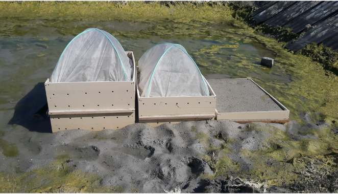
```


```{r etagesuperieur06042020, fig.align='center', out.width="70%", fig.cap="Etage supérieur"}
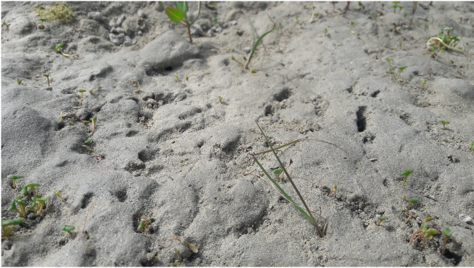
```


```{r etagemoyen06042020, fig.align='center',fig.show = "hold", out.width="70%", fig.cap="Etage moyen"}
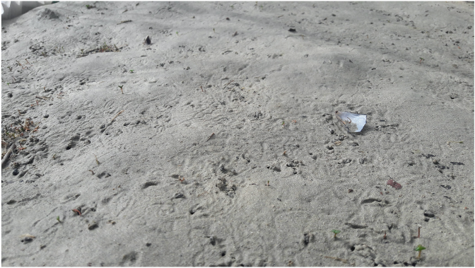
```

### 14/04/2020

```{r culturegeneral14042020, fig.align='center', out.width="70%", fig.cap="Aperçu général"}
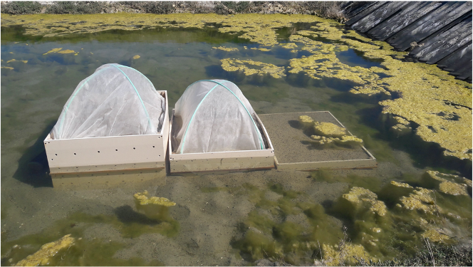
```


```{r etagesuperieur14042020, fig.align='center', out.width="70%", fig.cap="Etage supérieur"}
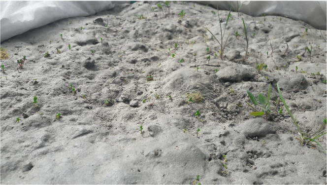
```


```{r etagemoyen14042020, fig.align='center',fig.show = "hold", out.width="70%", fig.cap="Etage moyen"}
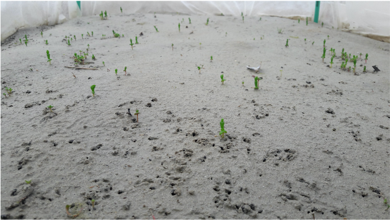
```

### 28/04/2020

```{r culturegeneral28042020, fig.align='center', out.width="70%", fig.cap="Aperçu général"}
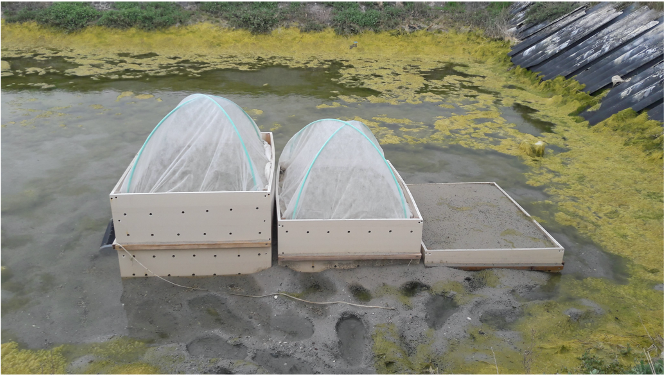
```


```{r etagesuperieur28042020, fig.align='center', out.width="70%", fig.cap="Etage supérieur"}
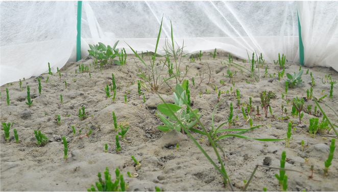
```


```{r etagemoyen28042020, fig.align='center',fig.show = "hold", out.width="70%", fig.cap="Etage moyen"}
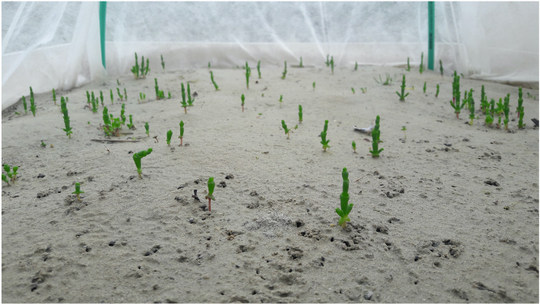
```

### 04/05/2020

```{r culturegeneral04052020, fig.align='center', out.width="70%", fig.cap="Aperçu général"}
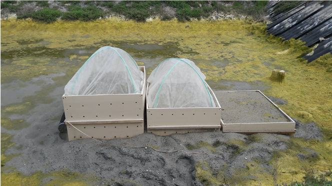
```


```{r etagesuperieur04052020, fig.align='center', out.width="70%", fig.cap="Etage supérieur"}
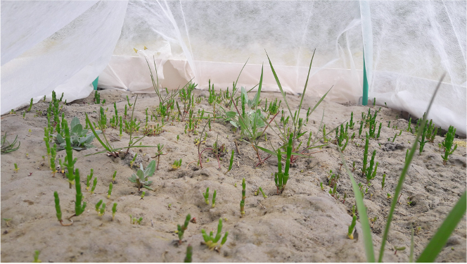
```


```{r etagemoyen04052020, fig.align='center',fig.show = "hold", out.width="70%", fig.cap="Etage moyen"}
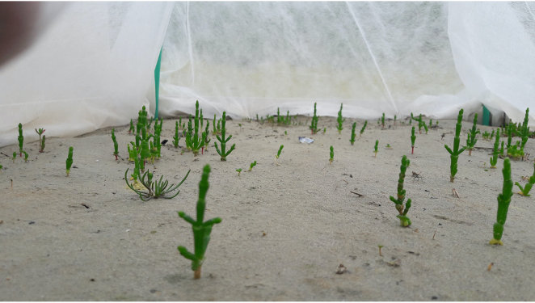
```


```{r etageinferieur04052020, fig.align='center', out.width="70%", fig.cap="Etage inférieur"}
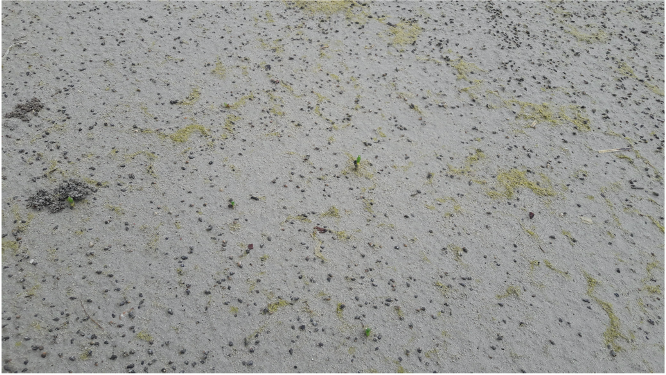
```


### 12/05/2020

```{r culturegeneral12052020, fig.align='center', out.width="70%", fig.cap="Aperçu général"}
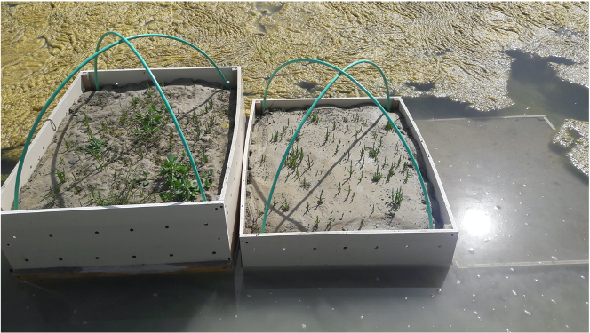
```


```{r etagesuperieur12052020, fig.align='center', out.width="70%", fig.cap="Etage supérieur"}
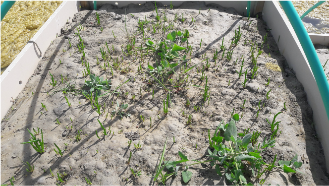
```


```{r etagemoyen12052020, fig.align='center',fig.show = "hold", out.width="70%", fig.cap="Etage moyen"}
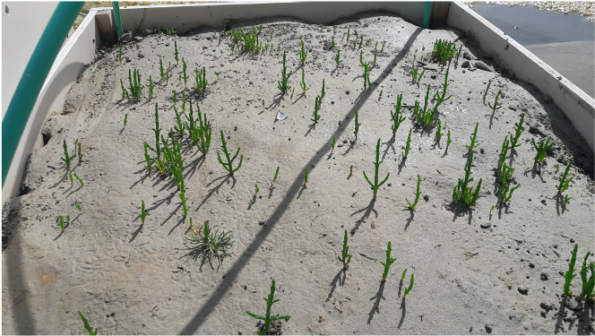
```

### 18/05/2020

```{r culturegeneral18052020, fig.align='center', out.width="70%", fig.cap="Aperçu général"}
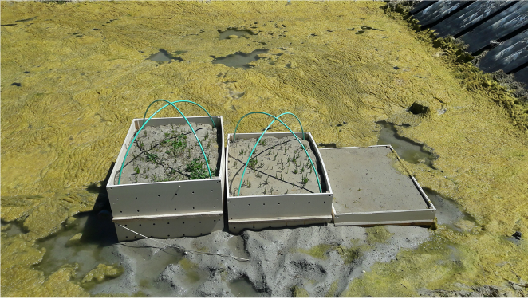
```


```{r etagesuperieur18052020, fig.align='center', out.width="70%", fig.cap="Etage supérieur"}
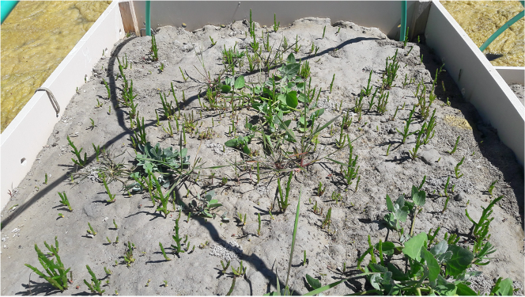
```


```{r etagemoyen18052020, fig.align='center',fig.show = "hold", out.width="70%", fig.cap="Etage moyen"}
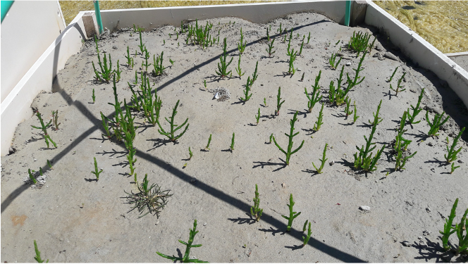
```


```{r etageinferieur18052020, fig.align='center', out.width="70%", fig.cap="Etage inférieur"}
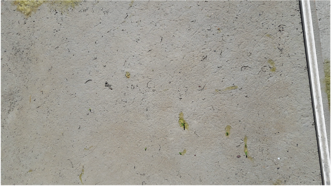
```

### 06/06/2020

```{r culturegeneral06062020, fig.align='center', out.width="70%", fig.cap="Aperçu général"}
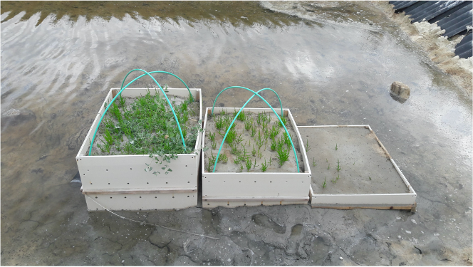
```


```{r etagesuperieur06062020, fig.align='center', out.width="70%", fig.cap="Etage supérieur"}
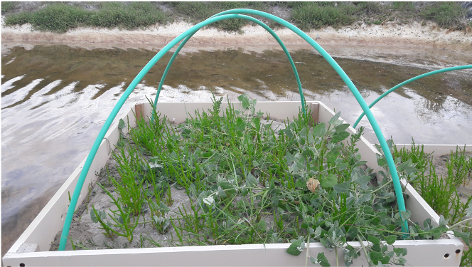
```


```{r etagemoyen06062020, fig.align='center',fig.show = "hold", out.width="70%", fig.cap="Etage moyen"}

```


```{r etageinferieur06062020, fig.align='center', out.width="70%", fig.cap="Etage inférieur"}
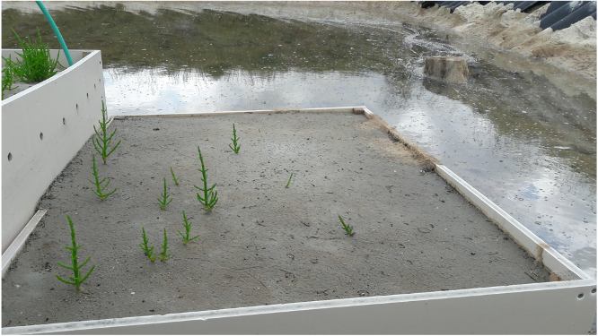
```

### 15/06/2020

```{r culturegeneral15062020, fig.align='center', out.width="70%", fig.cap="Aperçu général"}
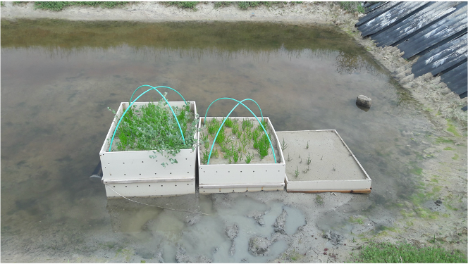
```


```{r etagesuperieur15062020, fig.align='center', out.width="70%", fig.cap="Etage supérieur"}
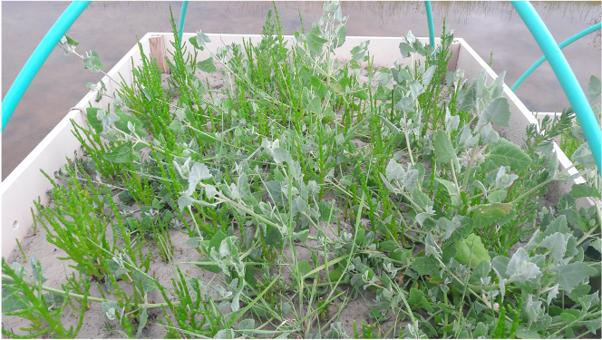
```


```{r etagemoyen15062020, fig.align='center',fig.show = "hold", out.width="70%", fig.cap="Etage moyen"}
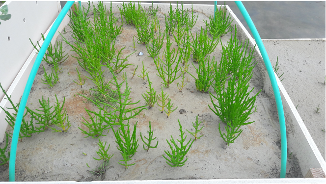
```


```{r etageinferieur15062020, fig.align='center', out.width="70%", fig.cap="Etage inférieur"}
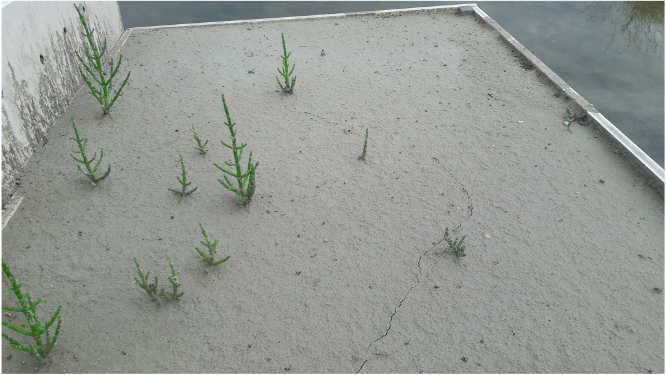
```

### 10/07/2020

```{r culturegeneral10072020, fig.align='center', out.width="70%", fig.cap="Aperçu général"}
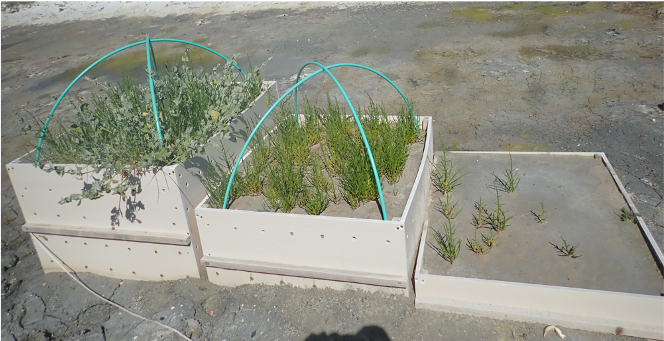
```


```{r etagesuperieur10072020, fig.align='center', out.width="70%", fig.cap="Etage supérieur"}
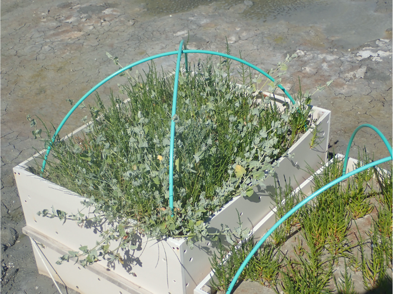
```


```{r etagemoyen10072020, fig.align='center',fig.show = "hold", out.width="70%", fig.cap="Etage moyen"}
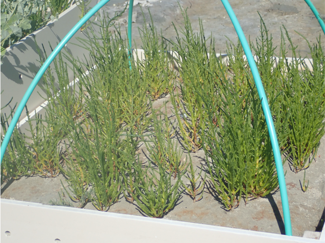
```


```{r etageinferieur10072020, fig.align='center', out.width="70%", fig.cap="Etage inférieur"}
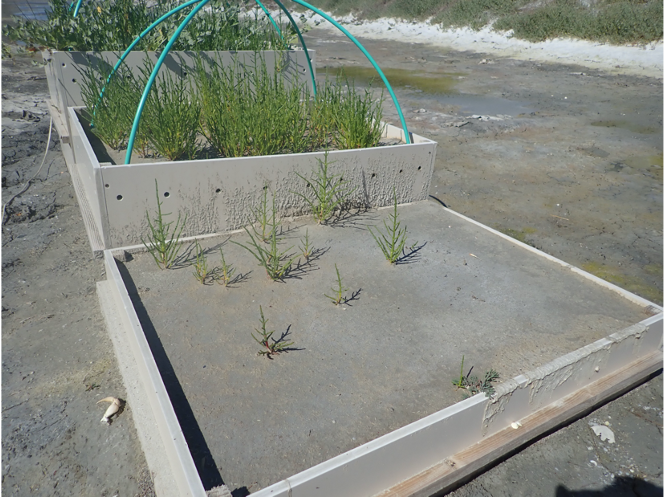
```

### 11/08/2020


```{r etagesuperieur11082020, fig.align='center', out.width="70%", fig.cap="Etage supérieur"}
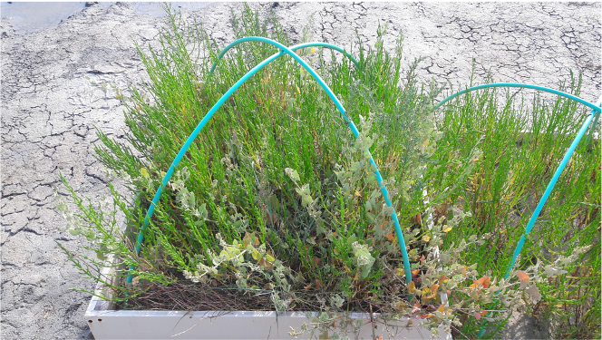
```


```{r etagemoyen11082020, fig.align='center',fig.show = "hold", out.width="70%", fig.cap="Etage moyen"}
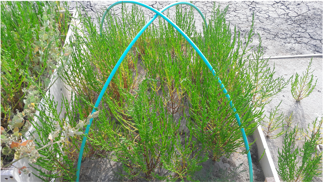
```


```{r etageinferieur11082020, fig.align='center', out.width="70%", fig.cap="Etage inférieur"}
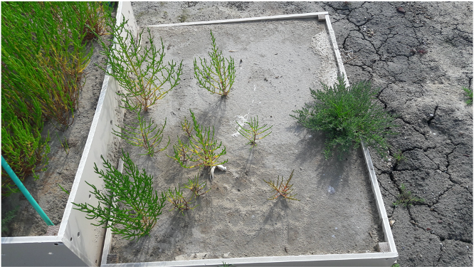
```


