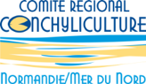

#### [**Le SMEL**](https://www.smel.fr/)

- *Sébastien Pien* : Chargé de missions

#### [**Le Cnam-Intechmer**](http://www.intechmer.cnam.fr/l-institut/)

- *Régis Gallon* : Maitre de conférences - écologie numérique - phycologue macrobenthique. 
- *Isabelle Poirier* : Maitre de conférences - Microbiologie
- *Martine Bertrand* : Maitre de conférences - Biochimie - Phytoplancton
- *Laure Verdier* : Assistante ingénieur

#### [**Comité Régional Conchylicole Normandie-Mer du Nord**](https://www.poleaquimer.com/fr/reseau/details-membre.html?mem_id=96)

- *Manuel Savary* : Directeur

