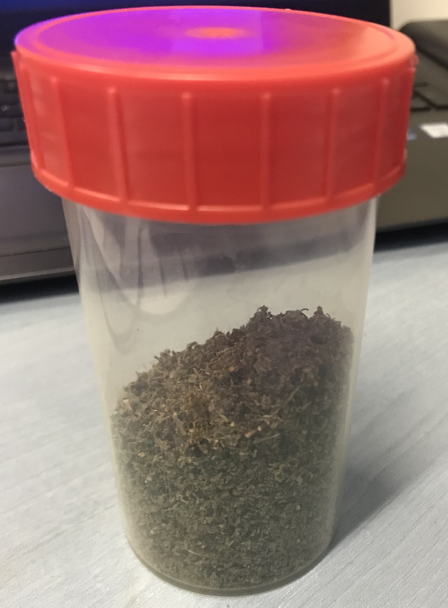
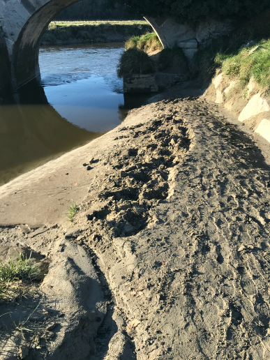
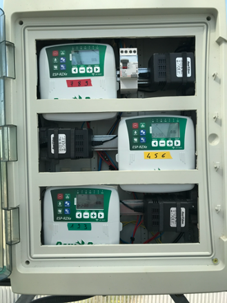
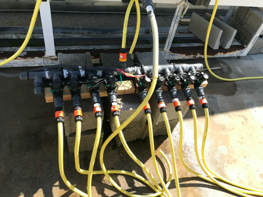

```{r setup, include=FALSE}
knitr::opts_chunk$set(
	message = FALSE,
	warning = FALSE,
	echo = FALSE)
require(tidyverse)
require(plotly)
require(lubridate)
require(ggmap)
library(gridExtra)
```

### Culture de la Salicorne

#### Récolte de graines à partir de plants "sauvages" 

Des plants matures ont été récoltés à proximité de la CABANOR dans le havre de Blainville en octobre 2019. Ces plants ont été triés pour ne sélectionner que l'espèce *Salicornia europaea*. Ils sont ensuite placés dans une étuve à 40°C pendant 24h puis stockés dans des sachets étanches (type ZipLock) pour les protéger de l'humidité. 

```{r etuveSalicorne, fig.align='center', out.width="50%", fig.cap="Séchage des plants matures dans une étuve à 40°C pendant 24h"}
knitr::include_graphics("./figures/proto_intechmer/sechagesalicorne.jpg")
```

Les graines sont extraites des plants sur une colonne de tamisage comportant 3 tamis (1mm, 630$\mu m$, 250$\mu m$). Seules les parties fertiles  (contenant les graines) sont conservées puis sont broyés à la main sur le tamis de 1mm pendant 5 minutes minimum pour s'assurer que toutes les graines sont bien sorties des les loges. Les graines et quelques résidus se retrouvent dans le refus du tamis de 250$\mu m$. 

La séparation des graines et des résidus se réalise par gravité dans de l'eau douce. En agitant régulièrement le mélange dans un récipient adapté, les graines vont sédimenter et s'agglomérer au fond et les résidus vont rester en surface. Cette phase ne dure pas plus de 5 minutes car les résidus vont s'hydrater et sédimenter par la suite. Plusieurs bains sont possibles en éliminant à chaque fois le surnageant afin d'obtenir un amas de graine homogène au fond du récipient.

Les graines sont ensuite récupérées à l'aide du tamis de 250 $\mu m$ puis séchées à l'étuve à 40°C pendant 24h en agitant régulièrement le contenant pour homogénéiser le séchage. Les graines peuvent ensuite être stockées dans un récipient sec et étanche pour la conservation à long terme.

```{r conservationGraine, fig.align='center', out.width="40%", fig.cap="Stockage des graines après séchage pour une conservation à long terme"}

```


#### Prélèvement du sédiment pour la culture de salicorne

Afin de réaliser des cultures avec un sédiment proche de celui des claires de la CABANOR, du sédiment prélevé a été prélevé au pont de la Roque (50, Figure \@ref(fig:cartesediment)). Les caractéristiques de ce sédiment seront détaillées dans la page [Résultat](resultat_intechmer.html).

```{r cartesediment, fig.align='center', fig.show = "hold", out.width=c("80%","35%"),fig.cap="Localisation du point de prélèvement pour le sédiment utilisé pour cultiver la Salicorne (WGS84)", cache=TRUE, fig.subcap=c("Localisation du prélèvement en Manche","Prélèvement au pont de la Roque", "Photographie du site de prélèvement")}
normandie <- c(left = -2.020171, bottom =48.665644 , right = -0.473931, top = 49.792502)
#pontdelaroque <- c(left=-1.610337,right=-1.485123,bottom=49.003728,top=49.044172)
normandieMap <- get_stamenmap(normandie, zoom = 10, maptype = "terrain-background")
pontdelaroqueMap <- get_map(location=c(lon=-1.5055584,lat=49.019549), zoom = 15, maptype = "terrain")
map1 <- ggmap(normandieMap)+geom_rect(aes(xmin=-1.610337,xmax=-1.485123,ymin=49.003728,ymax=49.044172),color="black",alpha=0)+
  ylab("Latitude")+xlab("Longitude")

map2 <- ggmap(pontdelaroqueMap)+geom_point(aes(x=-1.505584, y=49.019549),fill="red",color="red",size=4,shape=23)+
  ylab("Latitude")+xlab("Longitude")

grid.arrange(map1, map2, nrow = 1)



```


#### Mise en culture de la salicorne

Neuf bacs de 120cm x 60cm ont été installés sur la dalle expérimentale du Cnam/Intechmer (Figure \@ref(fig:planIrrigation)). Trois systèmes d'irrigation distribuant un volume différent d'eau de mer ont été installés (Tableau \@ref(tab:volumeirrigation)). Chaque système est installé dans trois bacs pour évaluer la reproductibilité. 

```{r planIrrigation, fig.align='center', fig.show = "hold", out.width="60%",fig.cap="Cultures expérimentales de salicorne au Cnam-Intechmer"}

knitr::include_graphics("./figures/proto_intechmer/plan_bac.jpg")

```

```{r volumeirrigation}
volumeIrrigation <- tibble(`Code couleur`= c("Rouge","Noir","Bleu"), `Débit goutte à goutte (l/h)`=c(8,4,2), `Débit du système d'irrigation par bac (l/h)`=c(144, 72, 36))

knitr::kable(volumeIrrigation,format="html", booktabs=TRUE, longtable = FALSE, caption = "Débit d'eau de mer pour chaque système d'irrigation testé") %>% 
  kableExtra::kable_styling(full_width = F)

```

L'irrigation est programmée par trois contrôleurs ESP RZXE (Rain Bird) couplés à des électrovannes 100 DVF (Rain Bird). Chaque contrôleur gère trois électrovannes correspondant à trois conditions différentes (Figure \@ref(fig:systemeIrrigation)).

```{r systemeIrrigation, fig.align='center', fig.show = "hold", out.width=c("40%","40%"),fig.cap="Contrôleurs et électrovannes installés pour les cultures expérimentales de salicorne au Cnam-Intechmer"}




```


#### Suivi de la croissance des plants de Salicorne

Dans chaque bac :

* Dénombrement du nombre de pied (toutes les 2 semaines)
* Distribution de la taille des plants par classe (toutes les 2 semaines)
* Mesure de l'activité photosynthétique à l'aide d'un PAM (1 fois par mois)


### Analyses microbiologiques et métagénomiques

#### Analyses microbiologiques du sédiment des bacs de culture

Durant toute la phase de culture de la salicorne, le sédiment superficiel oxique de chaque bac est prélevé pour dénombrer la flore totale hétérotrophe par la méthode Unité formant Colonie (UFC). Ainsi, tous les 3 mois, environ 10g de sédiments superficiels sont prélevés dans chaque bac grâce à une seringue tronquée stérile. Chaque échantillon est placé dans un flacon stérile identifié (numéro du bac et date de prélèvement), puis immédiatement conservé entre 0 et +4°C. Les analyses microbiologiques sont réalisées dans les 24 heures qui suivent le prélèvement. Pour chaque bac, 5g de sédiments, préalablement échantillonnés, sont broyés au mortier dans 20mL d’eau de mer stérile (suspension mère). Cette suspension mère est ensuite diluée en eau de mer stérile (deux dilutions en cascade au 1/10eme). 0.1mL de la dilution au 1/100^ème^ est étalée sur gélose marine agar (Difco, USA). Trois réplicas sont réalisés pour chaque bac. Les géloses marine agar sont incubées au moins 72 h à 22°C. Après incubation, les colonies sont dénombrées et le nombre d’UFC/g de sédiment est calculé.


#### Identification par métagénomique des groupes taxonomiques bactériens présents dans le sédiment superficiel oxique des bacs de culture.

Pour chaque bac de culture, le reliquat des sédiments prélevés pour les analyses microbiologiques est congelé à -80°C jusqu’à l’extraction de l’ADN génomique total.
L’ADN génomique total est extrait du sédiment grâce au kit d’extraction DNeasy PowerSoil de QIAGEN, et en suivant les instructions du fabriquant. A la fin de l’extraction, la concentration de chaque extrait d’ADN est mesurée et sa pureté vérifiée par spectrophotométrie (BioSpec-nano, Shimadzu). Les extraits d’ADN sont ensuite expédiés à la plateforme métagénomique INRA transfer (France) pour identifier les populations bactériennes par séquençage à haut débit. Le séquençage est réalisé sur un séquenceur MiSeq (Illumina). Les amorces utilisées ciblent les régions variables V4-V5 de la séquence de l’ARN ribosomique 16S des procaryotes (bactéries et archées). Le prétraitement des séquences est réalisé par un pipeline informatique développé par l’INRA et fonctionnant sous Mothur (version 1.36.1). 
Les barcodes, les primers, les séquences présentant des homo-polymères supérieurs à 8 pb ainsi que les chimères sont retirés des fichiers de séquences. Les séquences présentant 100% d’homologie entre elles, sont regroupées en séquences uniques, puis en OTU (operational taxonomic unit). L’analyse bio-informatique des données de séquençage (OTU) permet d’identifier les procaryotes présents (bactéries et archées) à différents niveaux taxonomiques (phylum, genre ou espèce). L’identification est réalisée sur la base de la taxonomie Greengenes.


### Granulométrie du sédiment

*En cours de rédaction*

### Composition élémentaire du sédiment


