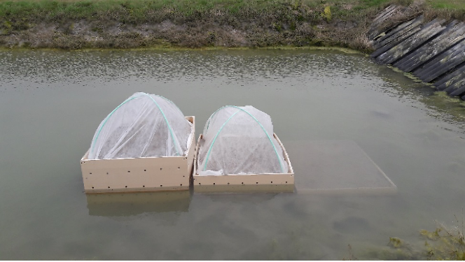

```{r setup, include=FALSE}
knitr::opts_chunk$set(
	message = FALSE,
	warning = FALSE,
	echo = FALSE)
require(tidyverse)
require(plotly)
require(lubridate)
require(ggmap)
library(gridExtra)
```

### Préparation de la claire

Du fait des différentes fuites d’eau de la claire, il est choisi de tester une culture sur différents niveaux. Trois bacs ont été installés dans la claire sur trois niveaux différents : 

- Un bac d’une hauteur de 60 cm
- Un bac d’une hauteur de 40 cm
- Un bac d’une hauteur de 20 cm

```{r bac-smel, fig.align='center',fig.cap="Bacs de cultures installés dans une claire ostréicole."}

```

Au moment de l’installation des bacs de culture comme au moment du semis, la claire était recouverte d’une vingtaine de centimètres d’eau, rendant impossible un semis sur le sol de la claire.

Le sédiment récupéré est le même que celui qui a été utilisé pour les bacs d’expérimentations à INTECHMER, soit de la tangue récupérée au Pont de la Roque le 27 janvier 2020. 

La claire avait deux sortes de fuites :

- Une fuite au niveau de la vanne d’arrivée d’eau. Cette fuite a été réparée le 14 février 2019.
- Des fuites dû à un défaut d’étanchéité général de la claire, impossible à rectifier dans l’immédiat. De ce fait, l’eau a tendance à s’évacuer excepté lors des marées hautes de vives eaux durant lesquelles la claire a tendance à se remplir d’eau de mer.

```{r claire-smel, fig.align='center',fig.cap="Claire ostréicole utilisée pour la culture expérimentale de Salicorne."}

```

### Semis de la Salicorne

Les graines ont été préparés selon le même protocole que pour les essais effectués à INTECHMER, avec les mêmes plantes récoltées au même moment.  

Le semis a été effectué le 06 février 2020 dans les trois bacs de culture à raison de 7 grammes de graines par bac. Le substrat a été légèrement ratissée au râteau avant semis puis tassée après semis afin d’éviter l’envol des graines (le vent était fort ce jour-là).
Les fuites de la claire et les grandes marées ont faits augmentés le niveau d’eau juste après le semis, laissant supposer que, pour le bac de 20 cm, le semis était très abimé voire complètement détruit.  

Les voiles de croissance ont ensuite été installés sur les bacs le 10 mars sur les bacs de 60 cm et 40 cm. Pensant que le semis était détruit dans le bac de 20cm, le voile n’a pas été installé.

```{r bac-semis, fig.align='center',fig.cap="Bacs de cultures préparés pour le semis."}

```


