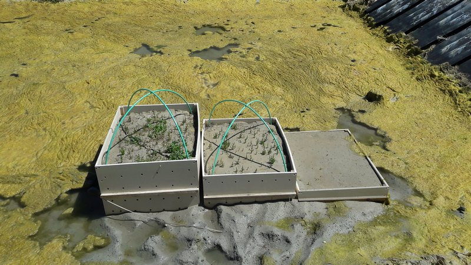
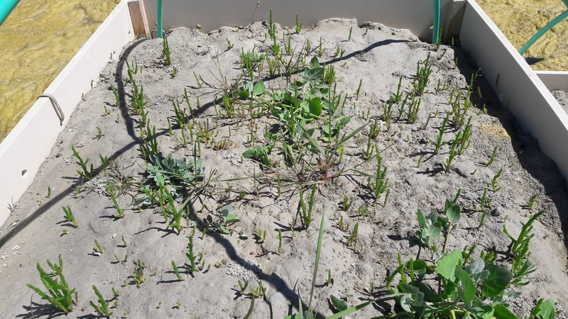
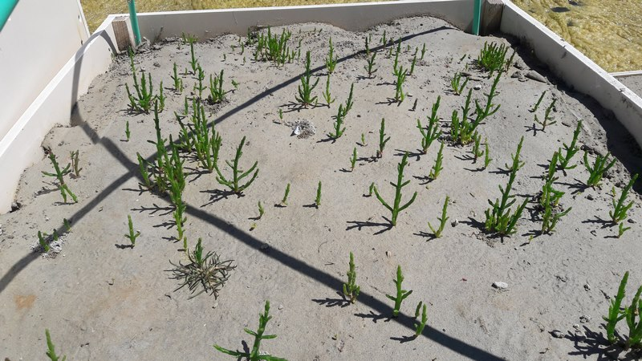
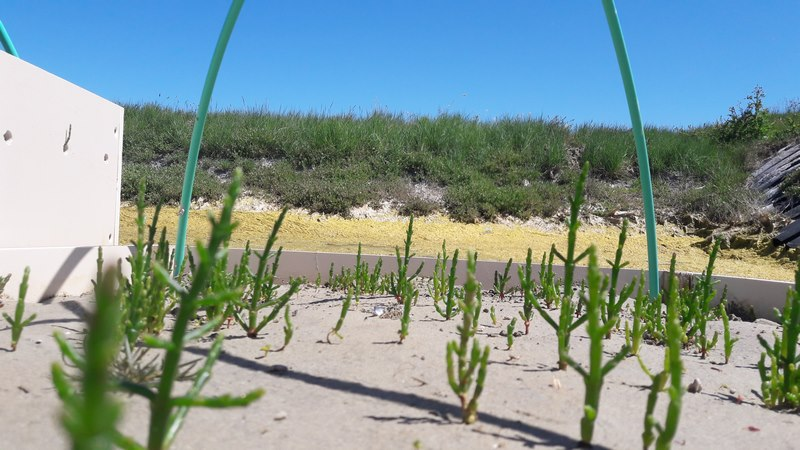
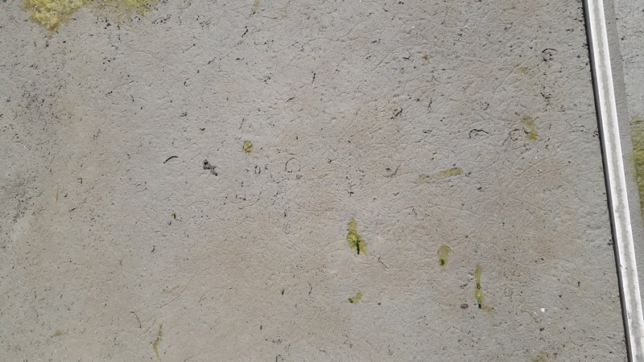

```{r setup, include=FALSE}
knitr::opts_chunk$set(echo = FALSE)
require(tidyverse)
require(plotly)
require(lubridate)
```


```{r culturegeneral, fig.align='center', out.width="70%", fig.cap="Dispositif expérimental mis en place dans une claire de la CABANOR"}

```


```{r etagesuperieur, fig.align='center', out.width="70%", fig.cap="Etage supérieur : 18/05/2020"}

```


```{r etagemoyen, fig.align='center',fig.show = "hold", out.width="40%", fig.cap="Etage moyen : 18/05/2020"}


```


```{r etageinferieur, fig.align='center', out.width="70%", fig.cap="Etage inférieur : 18/05/2020"}

```
