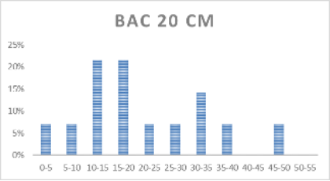
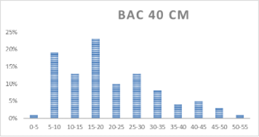
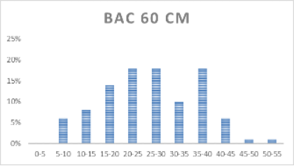
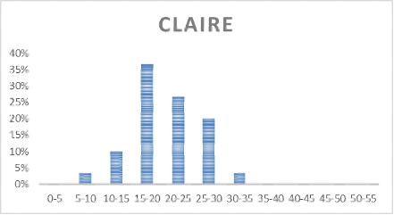
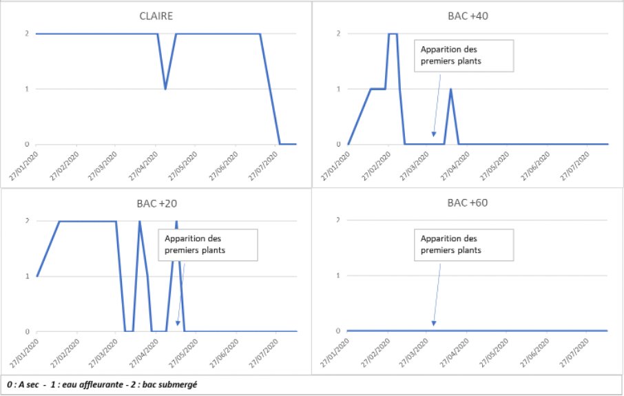

```{r setup, include=FALSE}
knitr::opts_chunk$set(echo = FALSE)
require(tidyverse)
require(plotly)
require(lubridate)
```

La récolte a eu lieu le 12 août 2020 dans les trois bacs et dans une claire située à proximité où la salicorne pousse naturellement. Les tableaux ci-dessous présentent les résultats obtenus.

### Résultats bruts sur la totalité des lots

```{r result-lots, fig.align='center',fig.cap="Tableau récapitulatif sur l'ensemble des 3 lots (+20cm / +40cm / +60cm)", out.width="100%"}

```

Il y a une grande diversité entre les différents bacs. Si le plus grand nombre de plants est relevé dans le bac 60cm, la biomasse totale comme la biomasse comestible est la plus importante dans le bac 40cm. Par contre, le bac 20 cm présente les meilleurs résultats tant sur le poids moyen qu’en proportion de biomasse comestible. Cependant, la densité de plants ne permet pas une véritable comparaison entre ce bac et les deux autres.

L’autre grande différence est le taux de mixité avec d’autres plantes halophytes très important dans le bac 60cm alors qu’il est très faible dans les deux autres bacs.

```{r result-echantillon, fig.align='center',fig.cap="Tableau récapitulatif sur des échantillons prélevés dans les 3 lots (+20cm / +40cm / +60cm) et la claire", out.width="100%"}

```

Des mesures individuelles sur des échantillons de 30 plants (excepté le bac 20cm) confirment les tendances observées sur le lot entier. On note que les résultats obtenus dans le bac 40cm sont similaires à ceux de la claire où les salicornes poussent naturellement. Pour des raisons différentes, les résultats du bac 60cm et du bac 20cm restent différents.

### Répartition de la taille des plants en fonction des classes de taille.

```{r result-taille, fig.align='center',fig.cap="Distribution des classes de taille sur l'ensemble des 3 lots (+20cm / +40cm / +60cm)", out.width="40%"}




```

Même si les échantillonnages sont assez faibles, on note des structures de populations assez différentes entre les 4 conditions. Dans la claire, la population est plus homogène (entre 15 et 25 cm) que dans les bacs, notamment dans le bac 60cm.

### Niveau d'eau dans les différents bacs et au niveau de la claire

```{r result-niveau, fig.align='center',fig.cap="Niveau d'eau dans les différents bacs et au niveau de la claire", out.width="70%"}

```

On voit que la claire était complétement à sec en fin d’expérimentation mais l’eau était présente environ 80% du temps. Par contre, la bac 60 cm n’a jamais été submergé. Pour les bacs 40 cm et 20 cm, ils ont subi une submersion plus ou moins importante après le semis, ce qui n’a pas empêché la croissance des salicornes par la suite


### Conclusion

-	**Bac 60cm** : c’est le bac avec le plus grand nombre de plants, mais avec un poids total moindre que dans le bac 40cm, donc un poids moyen faible (4g), malgré des plants dont la taille maximale s’échelonne entre 15cm et 40cm. L’autre point est la présence importante d’autres plantes halophytes en grande quantité comme l’obione, la spartine ou l’aster. A terme et dans une perspective d’exploitation de ces cultures, la présence de ces plantes compliquerait la récolte des salicornes.

- **Bac 40cm** : C’est le bac qui donne la biomasse la plus importante que ce soit en termes de poids total comme en termes de poids dit « comestible ». L’absence d’autres plantes permet une récolte de salicornes sans problème.

- **Bac 20cm** : A la base, le semis de ce bac était considéré comme complétement endommagé par la montée de l’eau qui a recouvert le bac une grande partie du temps pendant les premières semaines de culture. Malgré cela, même si la culture était réellement endommagée, 14 plants ont finalement poussé et donnait un poids moyen final deux fois plus élevée que dans le bac 40cm. Malgré une sortie de plants plus tardive, un mois après les deux autres bacs, la croissance permet d’obtenir des résultats supérieurs en termes de poids moyen. Cependant, la faible densité peut expliquer cette observation et il serait important de comparer ce bac aux deux autres sur une densité plants similaires. Il est à noter également que la partie comestible est plus importante. Les plants, plus jeunes, étaient moins ligneux que ceux récoltés dans les deux autres bacs.


